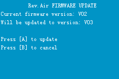
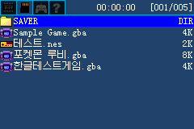
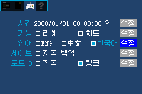
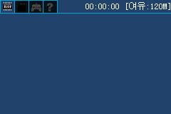

# ezflash-air-emulator

**EZ-FLASH Air의 카트리지 하드웨어(FPGA·SD·NOR)를 모델링해, 실기 없이 [한국어 커널](https://github.com/pangin/air-kernel-ko)을 부팅하고 메뉴·파일 브라우징·언어 전환까지 자동 테스트하는 헤드리스 하니스입니다.** mGBA 코어 위에 EZ-FLASH Air 디바이스 모델을 얹어, GBA 카트 버스로 오가는 레지스터 접근을 가로채 SD 카드(FAT 이미지)와 NOR 플래시를 흉내 냅니다.

> **English summary** — A headless test harness that models the EZ-FLASH Air cartridge hardware (FPGA registers, SD card, NOR flash) on top of mGBA, so the [Korean kernel](https://github.com/pangin/air-kernel-ko) can be booted into its menu, browse Korean filenames, and switch UI language **without real hardware**. Scenarios drive key input and assert on framebuffer pixels and persisted NOR state.

| 부팅(FW) | SD 한글 파일명 | 언어 전환(한국어) | 리셋 후 영속 |
|---|---|---|---|
|  |  |  |  |

---

## 무엇을 검증하나

위 스크린샷은 전부 **이 하니스가 실기 없이 자동 생성**한 것입니다. CI가 매 커밋마다 다음을 검증합니다.

1. **부팅** — 커널이 펌웨어 화면까지 부팅(0x08195000의 FPGA 비트스트림 CRC32 통과)
2. **메뉴 진입** — `B`로 FW를 넘기고 `f_mount`(SD)·NOR 게임목록 스캔을 거쳐 메뉴 렌더
3. **한글 파일명** — FAT 이미지의 한글 LFN이 UTF-8로 디코드되어 한글 폰트로 렌더
4. **언어 전환 + 영속성** — 설정에서 한국어로 전환 → NOR에 `0xE3E3` 기록 → **리셋 후에도 유지**(NOR 어서션)

## 무엇을 에뮬레이트하나

| 모델링함 | 안 함 |
|---|---|
| SD 블록 read/write (FAT 이미지 파일 대상) | NOR에 게임을 굽고 GAME 모드로 부팅 |
| NOR JEDEC 소거/워드 프로그램/autoselect ID — 설정·게임목록이 리셋 넘어 영속 | FPGA SPI 펌웨어 재기록 |
| SPI FPGA 버전 읽기(V03) | PSRAM/세이브 뱅크 전환 (수락만, 무동작) |

원리: 카트 ROM 버퍼를 **32MB로 강제**해 모든 카트 영역 읽기가 우리 버퍼에 떨어지게 한 뒤, 읽기 전에 필요한 바이트를 미리 채워(pre-poke) 둡니다. 쓰기(레지스터·JEDEC·SD 쓰기)는 ARM store 훅으로 가로챕니다. NOR 영속성은 리셋 시 카트 버퍼를 다시 로드하지 않기에 자연히 성립합니다.

## 빌드 & 실행

요구 사항: `cmake`, `ninja`, C 컴파일러, `python3`+`Pillow`(PPM→PNG 변환). SD 이미지 생성에 macOS는 `hdiutil`/`newfs_msdos`(기본 내장), Linux는 `mtools`+`dosfstools`.

```sh
git clone --recursive https://github.com/pangin/ezflash-air-emulator
cd ezflash-air-emulator

# 1) 테스트할 커널 이미지를 work/ 에 둔다 (air-kernel-ko 빌드 산출물 또는 CI 아티팩트)
cp /path/to/ezairkernel.bin work/

# 2) 하니스 빌드 (mGBA 코어 포함)
cmake -S . -B build/super -G Ninja
ninja -C build/super ezair-runner

# 3) SD 이미지 생성 + 전체 시나리오 실행 (스크린샷은 out/*.png)
bash tools/run_tests.sh work/ezairkernel.bin
```

단일 시나리오 직접 실행:

```sh
./build/super/ezair-runner work/ezairkernel.bin \
    --sd work/sd.img --scenario scenarios/sd_browse.txt --out out [--trace]
```

## 시나리오 파일 형식

`scenarios/*.txt`, 한 줄에 한 명령(`#` 주석). GBA 키 비트: `A=1 B=2 SELECT=4 START=8 RIGHT=0x10 LEFT=0x20 UP=0x40 DOWN=0x80 R=0x100 L=0x200`.

| 명령 | 동작 |
|---|---|
| `keys <mask>` | 눌린 키 설정(유지) |
| `frames <n>` | 현재 키로 n프레임 실행 |
| `tap <mask> [hold] [gap]` | mask를 hold프레임 누르고 gap프레임 떼기(기본 6/6) |
| `reset` | 코어 리셋(NOR/SD 상태는 유지) |
| `shot <name>` | `out/<name>.ppm` 저장 |
| `assert_nonblank <name> <x> <y> <w> <h>` | 영역이 단색(미렌더)이면 실패 |
| `assert_nor16 <off> <val>` | 영속 NOR 윈도(0x09000000 기준) 16비트 값 검증 |
| `log <text>` | 마커 출력 |

## 새 시나리오 추가

`scenarios/`에 `.txt`를 추가하면 `tools/run_tests.sh`가 자동으로 포함합니다. 화면을 눈으로 확인하려면 `shot`을 찍고 `out/*.png`를 보세요. 픽셀/상태 회귀를 막으려면 `assert_nonblank`·`assert_nor16`을 함께 넣습니다.

## CI

`.github/workflows/ci.yml`이 두 잡으로 동작합니다. ① `devkitpro/devkitarm` 컨테이너에서 `air-kernel-ko@korean`을 **실제 빌드**해 `ezairkernel.bin` 생성 → ② 우분투에서 하니스를 빌드하고 SD 이미지를 만들어 전체 시나리오를 돌리며, 스크린샷을 아티팩트로 올립니다. 즉 이 레포는 **커널의 하드웨어-프리 통합 테스트**입니다.

## 라이선스

이 프로젝트 코드는 **Apache-2.0**([LICENSE](LICENSE)). mGBA는 서브모듈로 **수정 없이** 사용하며 **MPL-2.0**입니다([NOTICE](NOTICE) 참고).
